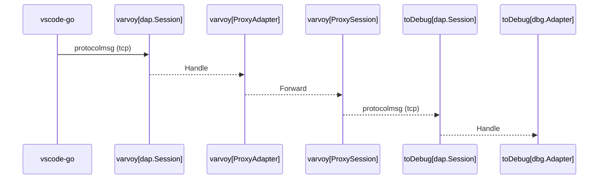

```mermaid
sequenceDiagram
    vscode-go ->> varvoy[dap.Session]: protocolmsg (tcp)
    varvoy[dap.Session]-->>varvoy[ProxyAdapter]: Handle
    varvoy[ProxyAdapter]-->>varvoy[ProxySession]: Forward
    varvoy[ProxySession]-->>toDebug[dap.Session]: protocolmsg (tcp)
    toDebug[dap.Session]-->>toDebug[dbg.Adapter]: Handle
```
